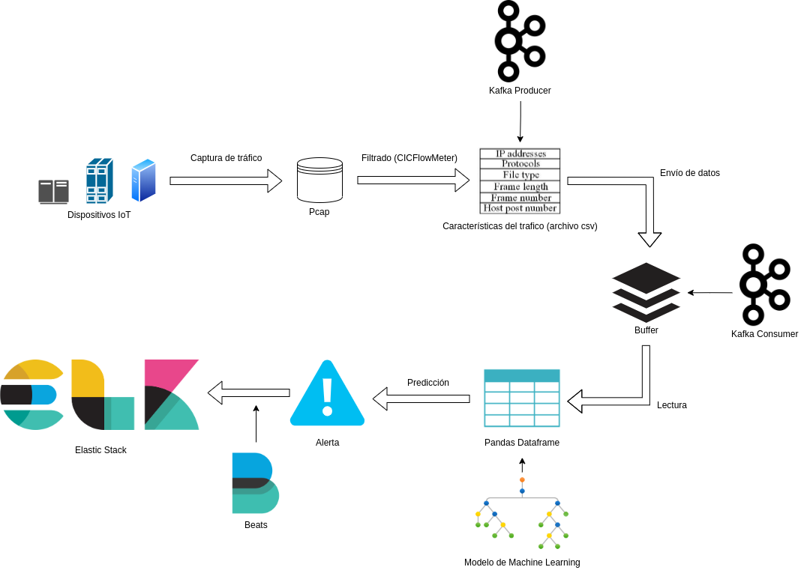

# Deteccion de intrusiones utilizando Machine Learning

[Volver a documento raíz](https://gitlab.unc.edu.ar/csirt/csirt-docs/tree/master#csirt-docs)

En el siguiente documento se detalla como instalar y poner en funcionamiento el Sistema de Detecciones de Intrusiones implementado con tecnicas de Machine Learning.

## Arquitectura del sistema



## 1. Requerimientos

Se detallan los requisitos necesarios para la instalacion del sistema.

### Requerimientos de Hardware

El hardware necesario es dependiente del enlace el cual se quiere monitorear.
El sistema fue probado monitoreando un enlace de 300 Mb/s (promedio) en una maquina virtual con las siguientes especificaciones:

+ Núcleos CPU: 4
+ RAM: 8
+ Almacenamiento: 50 Gb

Tambien es importante destacar que el sistema puede funcionar en serie (monitoreando el enlace de entrada de nuestro host) o en paralelo (monitoreando otro enlace).
En el segundo caso, es necesario tener en nuestro servidor, un mirror del enlace a monitorear.

### Requerimientos de software

El sistema esta diseñado para trabajar en sistema operativo Debian o Ubuntu. Se desconoce si funciona para otros SOs.
El unico prerequisito de software es tener instalado Python3.

#### Instalando requerimientos

Puede instalar las dependencias utilizando los siguientes comandos:

```bash
sudo apt-get install python3-pip
sudo apt-get install tcpdump
sudo apt-get install libpcap-dev
sudo apt-get install python3-venv
sudo apt-get install inotify-tools

sudo apt-get install \
    apt-transport-https \
    ca-certificates \
    curl \
    gnupg2 \
    software-properties-common
    
curl -fsSL https://download.docker.com/linux/debian/gpg | sudo apt-key add -

sudo add-apt-repository \
   "deb [arch=amd64] https://download.docker.com/linux/debian \
   $(lsb_release -cs) \
   stable"

sudo apt-get update
sudo apt-get install docker-ce docker-ce-cli containerd.io
sudo curl -L "https://github.com/docker/compose/releases/download/1.24.0/docker-compose-$(uname -s)-$(uname -m)" -o /usr/local/bin/docker-compose
sudo chmod +x /usr/local/bin/docker-compose
sudo apt install default-jre
sudo apt install default-jdk
```

Una vez instaladas las dependencias, es necesario crear y activar un entorno virtual de Python:

```bash
python3 -m venv <NombreDelEntornoVirtual>
source /<NombreDelEntornoVirtual>/bin/activate
```

Por ultimo, es necesario instalar las dependencias de Python, que se encuentran en el archivo requerimientos.txt:

```bash
sudo pip3 install -r requerimientos.txt
```

## 2. Configuracion

Para poder ejecutar el script **capture_interface_pcap.sh** se necesita dar los permisos necesarios para ejecutar tcpdump al servicio AppArmor. Simplemente agregue la siguiente línea en el archivo **/etc/apparmor.d/usr.sbin.tcpdump** :

```bash
/usr/sbin/tcpdump {
  ...
  # for -z
  /**/* ixr,
  ...
}
```
Luego simplemente reinicie el servicio:

```bash
sudo service apparmor restart
```

Por ultimo, es necesario habilitar los corredores Kafka en el archivo **/etc/ hosts**. Simplemente ejecute el siguiente comando:

```bash
echo 127.0.1.1 kafka >> /etc/hosts
```

## 3. Puesta en marcha

Antes de poner el sistema en funcionamiento, se necesita crear los contenedores Docker de Kafka:

```bash
sudo ./run_compose.sh
```

Luego, simplemente debe se debe ejecutar el script **start** que se encarga de ejecutar todos los archivos necesarios para el funcionamiento del sistema:

```bash
./start.sh
```

Para detener los procesos, simplemente se cancela el proceso en primer plano con **Ctrl + C** y luego ejecutar el script **stop**:

```bash
./stop.sh
```

No es necesario ejecutar los script con permisos de superusuario.


Con esto, el programa queda en funcionamiento. Las alertas de ataque se guardan en el archivo **alert.log** en la carpeta **src**.

## 4. Envio de logs a ElasticSearch

Para enviar las alertas generadas por el IDS al servidor master de Security Onion, debe instalar Filebeat en su maquina. Para Debian, puede utilizar los siguiente comandos:

```bash
curl -L -O https://artifacts.elastic.co/downloads/beats/filebeat/filebeat-7.4.2-amd64.deb
sudo dpkg -i filebeat-7.4.2-amd64.deb
```

Luego, debe editar el archivo de configuracion, el cual se encuentra en **/etc/filebeat/filebeat.yml**. Se debe actualizar la informacion de input y output con las siguiente lineas (asi es como debe quedar el archivo, no son lineas a agregar):

```bash
filebeat.inputs:

- type: log

  enabled: true

  paths:
    - /home/debianml/idsFinal/src/alert.log
```
```bash
output.logstash:

  hosts: ["<IP del servidor master de Security Onion>:5044"]

  index: filebeat
```
Si se utiliza el servidor master actual (el 172.16.81.50), no necesita realizar ninguna configuracion extra. En caso de querer utilizar un nuevo servidor master, debe configurar los filtros de logstash para que pueda leer las nuevas alertas de nuestro IDS.
Para mas informacion sobre como editar los filtros de logstash, puede ver:

[Guia de administracion de logstash](https://gitlab.unc.edu.ar/csirt/csirt-docs/blob/master/security-onion/master/logstash/master-logstash-guide.md)

Se debe realizar la siguiente configuracion en el archivo **9500_output_beats_custom.conf:**

```bash
filter {
    grok {
      match => {"message" => "%{TIMESTAMP_ISO8601:timestamp} %{IP:source_ip} %    {IP:destination_ip} Priority: %{NUMBER:priority} - %{WORD:protocol} - \[%{DATA:attack}\]"}
  }
}

output {
  if "beat" in [tags] {
    elasticsearch {
      hosts => elasticsearch
      index => "logstash-beats-%{+YYYY.MM.dd}"
      template_name => "logstash-beats"
      template => "/beats-template.json"
      template_overwrite => true
    }
  }
}
```


